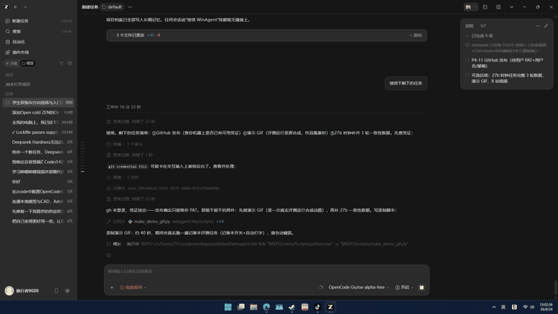

# WinAgent-Lite



本地视觉模型驱动的 Windows GUI Agent，附带可复现评测集——让 GUI 自动化从"能演示"变成"能度量"。

A local-vision-driven Windows GUI agent with a reproducible benchmark — turning GUI automation from "demoable" to "measurable".

## 为什么做这个 / Why

大模型操控真实电脑（Computer-Use Agent）大多跑在云端大模型上。本项目回答一个更朴素的问题：**一台没有独立显卡的普通 Windows 电脑，用本地小模型当眼睛 + 便宜的真实键鼠事件当手，到底能做到什么程度？** 答案用成功率数据说话，不靠演示视频。

Most computer-use agents rely on large cloud models. This project answers a humbler question: **on an ordinary GPU-less Windows PC, how far can a local small vision model (as eyes) plus real input events (as hands) actually get?** Answers are given in success rates, not demo videos.

## 架构 / Architecture

```
vision.py   眼睛: 截屏 -> 降采样 -> Ollama VLM -> 元素坐标/屏幕问答
hand.py     手:   user32 真实鼠标 + SendInput 键盘(UNICODE 直输, 中文可)
agent.py    脑干: 定位->点击->验证->容差偏移重试 的闭环 + 步骤解释器
bench.py    度量: 任务 YAML(含 setup/teardown 重置) -> N 次运行 -> 成功率报告
planner.py  规划: 自然语言目标 -> 步骤 JSON (本地文本模型, 云API适配器预留)
mcp_server.py 生态: 把眼/手/闭环暴露为 6 个 MCP 工具, 任意 harness 可调用
```

## 快速开始 / Quickstart

```bash
git clone <repo> && cd winagent-lite
python -m venv .venv && .venv/Scripts/pip install -e .
# 需要 Ollama 本地跑着视觉模型 (默认 qwen2.5vl:7b)
cp config.example.yaml config.yaml   # 按需改模型名

winagent look "任务栏右下角的时钟时间数字"   # 眼睛: FOUND x,y
winagent click 1824 1056                 # 手: 真实点击
winagent run scenarios/notepad_save.yaml # 闭环: YAML 步骤序列
winagent bench                           # 评测: 全任务成功率报告
winagent plan "打开记事本输入你好并保存"     # 规划: 目标 -> 步骤 JSON
```

## 评测设计 / Benchmark Design

- **任务**：`bench/tasks/*.yaml`，每个含 `setup`（环境重置）/ `steps`（与场景同语法）/ `verify`（成败判定）/ `teardown`（清理），杜绝状态污染。
- **验证分级**：**A 级** = 文件内容/进程存在等确定性判定（可信）；**B 级** = VLM 看图判定（有噪声，报告标注）。
- **轨迹存档**：每次运行存 `runs/bench/<任务>/run<k>/{trace.json, final.png}`，失败可回放归因。
- **对照实验**：同一任务换不同大小的眼睛模型（3b / 7b / 27b），量化"眼睛尺寸 vs 成功率"。
- 最新基线报告：`docs/baseline_v0.2.md`（7/10 任务 100%，其余为模型能力边界数据点）。

## 实测发现 / Field Findings

用真实键鼠事件跑 Windows 得到的硬结论（完整版见 `docs/baseline_v0.2.md`）：

1. **另存为类对话框是合成输入雷区**：中文 IME 吞 Enter、Alt+S 无效、自动补全下拉困住键盘焦点；合成鼠标点击本身有效。正确姿势是"无对话框"交互设计。
2. **视觉坐标存在 1~3% 系统性偏差**（实测差 6px 点到任务栏外）：闭环必须带"验证 + 容差偏移重试"，本项目实测第二次尝试自动修复。
3. **小图标定位是本地小模型的能力边界**：qwen2.5vl:7b 系统性找不到开始按钮，qwen3.8:27b 一次命中精确到像素。
4. **启动竞态**：固定 sleep 赌窗口就绪必输，轮询前台窗口标题（focus wait）才稳。
5. **打字要按字符类分流**：UNICODE 直输绕过中文 IME 但 WinUI 计算器不认运算符；虚拟键会被 IME 劫持大小写。auto 策略 = 字母数字中文走 UNICODE、标点运算符走虚拟键原子提交。
6. **Win11 记事本会话恢复会复活未保存标签**：评测 setup 必须清 TabState。
7. **视觉点击把光标放在点击处**：打字前先 Ctrl+End 移到文末。

## MCP 接入 / MCP Integration

任意支持 MCP 的 harness（ZCode 等）配置：

```json
{
  "mcpServers": {
    "winagent": {
      "command": "<repo>/.venv/Scripts/python.exe",
      "args": ["-m", "winagent.mcp_server"]
    }
  }
}
```

提供工具：`look` / `click` / `type_text` / `key` / `act`（闭环）/ `run_scenario`。

## 安全边界 / Security

- Ollama 请求地址仅允许 http/https 且主机限本机/内网（公网拒绝、禁重定向）。
- 程序启动与进程操作全部白名单 + 字面量命令，任务文件无法执行任意命令。
- 文件类操作限制在 Temp 目录下。

## 路线图 / Roadmap

- [x] P0 项目骨架
- [x] P1 眼睛 / 手 / 闭环 agent（焦点等待 + 容差自愈）
- [x] P2 评测集 10 任务 + bench runner + 基线报告
- [x] P3 planner（本地模型版；云 API 适配器待 Key）+ MCP server
- [ ] P4 发布（双语 README ✓ / 演示素材 / GitHub）

## License

MIT
